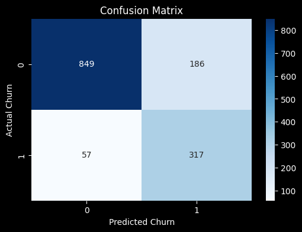
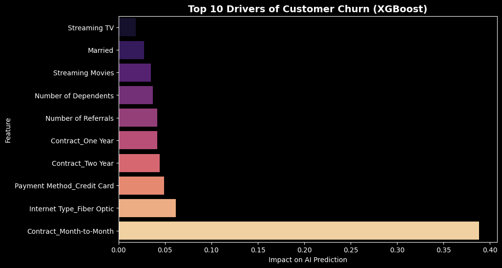
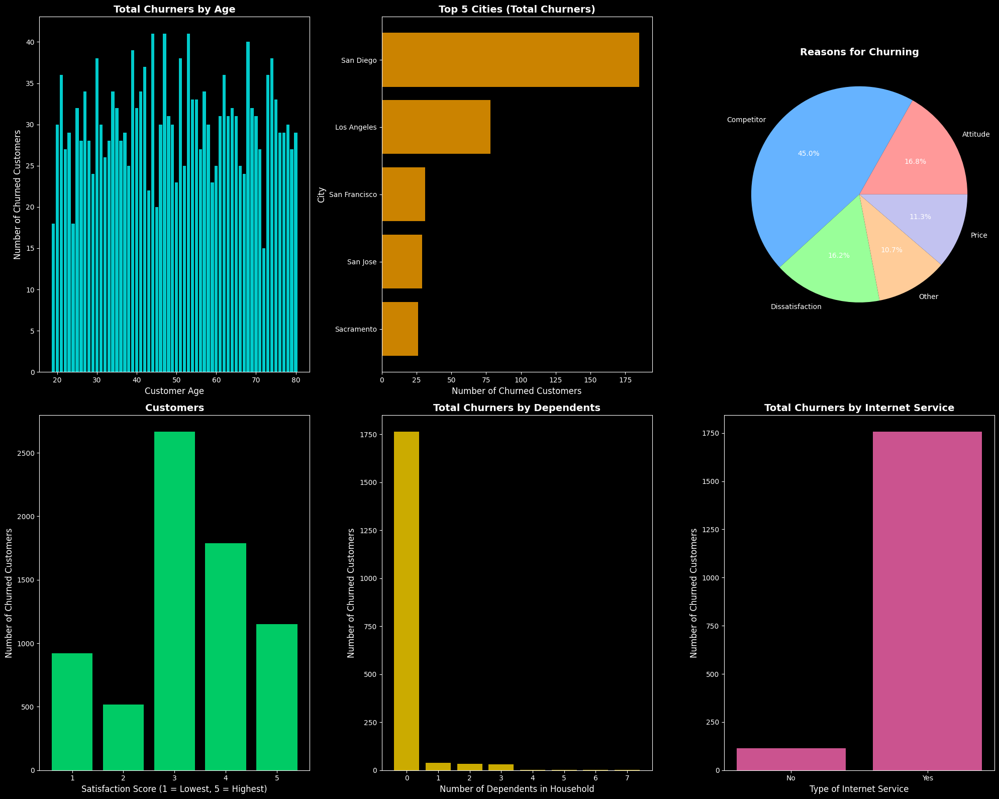

# Telecom Customer Churn Prediction: 85% Recall

## Project Overview
The goal of this project was to predict which customers are at the highest risk of leaving a telecom service and, more importantly, identify the core business drivers causing them to churn. 

By catching these customers before they cancel, the business can proactively offer targeted retention discounts, saving thousands of dollars in customer acquisition costs.

## Tech Stack
* **Data Manipulation:** Pandas, NumPy
* **Machine Learning:** Scikit-Learn, XGBoost (`XGBClassifier`)
* **Data Visualization:** Matplotlib, Seaborn
* **Techniques Used:** Missing Value Imputation, MinMax Scaling, One-Hot Encoding, Hyperparameter Tuning (GridSearchCV), Class Imbalance Handling (`scale_pos_weight`).

## Model Performance
Because the cost of losing a customer is much higher than the cost of a retention discount, this model was optimized strictly for **Recall**. 
* **Recall:** 85% (The model successfully identified 317 out of 374 actual churners).
* **Precision:** 63% (The model accepts a slightly higher false-positive rate to cast a wider net and save as many customers as possible).

## Business Recommendations
Based on the XGBoost Feature Importance analysis and Exploratory Data Analysis, I recommend the following three immediate business actions:

1. **The Month-to-Month Crisis:** Customers on month-to-month contracts are churning at the highest rate. **Action:** Launch an aggressive marketing campaign offering a 15% discount for users who upgrade to a locked-in 1-year contract.
2. **The Fiber Optic Problem:** Fiber Optic internet is the second-highest driver of churn, indicating severe product dissatisfaction. **Action:** Pause aggressive upselling of Fiber Optic and initiate an engineering audit to check for local network outages or speed throttling. 
3. **The Credit Card Friction:** Customers paying via Credit Card are churning at unexpectedly high rates. **Action:** Investigate the billing gateway for failed auto-payments/expired cards, and incentivize customers to switch to direct bank transfers.

## Visualizing the Problem
